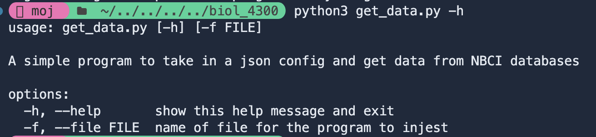

# Scripts

## Dependencies for scripts

### Python Dependencies

All of the library dependencies are located in the requirements.txt to install them into your own environemnt run:

```bash
pip install -r requirements.txt
```

All python scripts were ran on `Python 3.13.7`

### R Dependencies

To verify you have all the required packages run `requirements.R`. This will only install packages you don't already have.

### NCBI API Key

This code requires a API key from NCBI and email address. These should be in a .env file and never input directly into the code.
For more informtion on getting an api key visit: [NCBI API Keys](https://support.nlm.nih.gov/kbArticle/?pn=KA-05317)

To setup your environment variables, edit the `api-key` and `email` in `.env.sample` and rename the file to remove `.sample`

```bash
ncbi_key=<api-key>
ncbi_email=<email>
```

## 1. Get Accession Numbers from Genbank

### Running Script

To run the `get_tables.py` script from the project root.

```bash
python3 scripts/get_tables.py
```


### JSON Configuration

This script automatically looks for a `JSON` file in the same folder as the script named `config.json` at the root. If you want to pass in a differnt file it is the first argument given after the file name or you can specify using the `-f` or `--file` flag



This program creates a folder called data in the project root if it doesn't already exist, and a `csv` file for every gene listed in the json. The `csv` contains txid, scientific name, accession number, sequence name, and sequence length.

The JSON has a list of any tax id you want to search for
As well as the following information on each gene you want to search for:

- **Name:** for logging on the console loading bar
- **Term:** used in the entrez term parameter
- **File Prefix:** used to name each file, for example if I have a file prefix of `mt` will give you `mt_table.csv`. For an example of the JSON format see `config.json`

## 2. Getting table with all accession numbers

Looks in the folder `./data/tables` for all files that end with `_table.csv`. Makes one table with taxid, scientific name, and a column for each table found that contains the accession numbers. The resulting table is in `./data/tables/master_accessions.csv`

### Usage

```bash
python3 scripts/get_master_table.py
```

## 3. Getting fasta data

Gets fasta data from Genbank using Entrez library. Looks in the `./data/tables/master_accessions.csv` file by column and queries for the fasta data.One fasta file is created for each gene column in the csv file. Fasta files are output to `./data/raw_data/<gene>_seqs.fasta`

### Usage

```bash
 python3 scripts/get_fastas.py
```

## 4. Creating Alignments

This Bash script automatically aligns all raw FASTA sequence files using **MAFFT**. It searches the `./data/raw_data/` folder for any `*_seqs.fasta` files and saves the resulting alignments to `./data/alignments/`.

### Usage

Run from the project root:

```bash
./scripts/get_alignments.sh
```

Each input file named like:

```
data/raw_data/<gene>_seqs.fasta
```

will produce an aligned output:

```
data/alignments/<gene>_alignment.fasta
```

### Requirements

- **[MAFFT](https://mafft.cbrc.jp/alignment/software/)** must be installed and available in your system path
  _(Test with `mafft --version`)_

## 5. Trimming Alignments

This script (`trim.R`) automatically trims DNA alignments by removing gapped sites based on a given threshold, we ran this using 0.8. It processes all `*_alignment.fasta` files in the `data/alignments/` folder and saves the cleaned versions to `data/trimmed_alignments/`.

### Usage

Run from the project root as your working directory run `trim.R`

Each trimmed file is saved as `<gene>_trimmed.fasta` in the output directory.

## 6. Building the Supermatrix

This python script `make_supermatrix.py` combines all trimmed gene alignments into a single concatenated **supermatrix** for phylogenetic analysis. It uses the `AMAS` library.

### Usage

```bash
python3 scripts/make_supermatrix.py
```

The script will:

1. Read all `*_trimmed.fasta` files in `data/trimmed_alignments/`
2. Concatenate them into a single alignment (supermatrix)
3. Save the results in `data/supermatrix/`

## 7. Trees

## Maximum Likelihood Tree

This command builds a maximum likelihood (ML) phylogenetic tree from the concatenated supermatrix alignment using [**IQ-TREE 3**](https://iqtree.github.io/). The analysis runs 1000 bootstrap replicates and automatically uses all available CPU cores.

### Usage

From project root run

```bash

iqtree3 \
 iqtree3 \
-s data/supermatrix/supermatrix.nex \
-p data/supermatrix/partitions.txt \
-B 1000 \
-T AUTO \
--prefix trees/ml_trees/iqtree_supermatrix

```

## Bayesian Trees

Ran with BEAUTi and BEAST2

Parameters used:

- HKY substitution model
- Strict clock
- 100,000,000 chain
- Calibrated yule
- Calibration point at 45 MYA split with Ursidae
- Logged every 1000

## 8. Tree Visualization

Final Tree made by running the `tree_vis.R` script. It runs on the ML tree generated in step 7.
